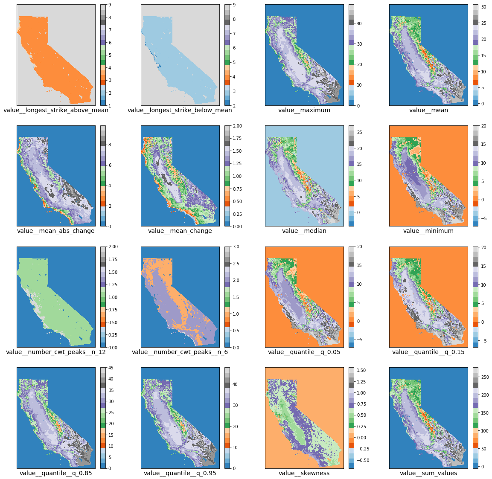

# ts-raster

ts-raster is a python package for analyzing time-series characteristics from raster data. 
It allows feature extraction, dimension reduction and applications of machine learning techniques for geospatial data.

- input data : historical raster data (e.g. Monthly temperature data (2000-2018) 
- extracted features: Mean, minimum, maximum, variance, standard deviation... of the input data
- output: dataframe with features as columns or raster file with features as bands


### Installation
stable version:
    
    pip install tsraster

from github: 

    git clone https://github.com/mmann1123/ts-raster.git
    cd ts-raster
    pip install e .


### Input Data Structure

The input raster files from which features will be extracted are organized to allow extraction from files contained multiple folders.

Example data for annual summaries:

    temprature
        2005
            tmx-200501.tif 
            tmx-200502.tif
            tmx-200503.tif ...
        2006
            tmx-200601.tif
            tmx-200602.tif
            tmx-200603.tif...
        2007
            ...
            
Example data for multi-period (5 year) summaries:  
     temprature
        2005-2010
            tmx-200501.tif 
            ...
            tmx-201012.tif
        2011-2015
            tmx-201101.tif 
            ...
            tmx-201512.tif
        ...
        
 temprature: *the variable* <br>
  - 2005, 2006, 2007: *the years* <br>
    - tmx-200501.tif: the image <br>
        - tmx : unique identifier of each image <br>
        - 200501: year and month 
    
<br>

ts-raster will consider the value '200501' as a unique time identifier.

#### Usage:


```python

from tsraster.prep import sRead as tr
from tsraster.calculate import calculateFeatures


#directory
path = "../docs/img/temperature/"


image_name = tr.image_names(path)
print(image_name)
```

    ['tmx-200601', 'tmx-200603', 'tmx-200602', 'tmx-200703', 'tmx-200702', 'tmx-200701', 'tmx-200501', 'tmx-200502', 'tmx-200503']


Convert each image to array and stack them as bands


```python

rasters = tr.image2array(path)
rasters.shape
```
    (1120, 872, 9)


Calculate Features

 The number of features one can extract can be customized by choosing from the complete list of the statistical summaries
 listed [here](https://tsfresh.readthedocs.io/en/latest/text/list_of_features.html). 
 The following example, for instance, contains 16 features.

            parameters = {
            "mean": None,
            "maximum": None,
            "median":None,
            "minimum":None,
            "mean_abs_change":None,
            "mean_change":None,
            "quantile":[{"q": 0.15},{"q": 0.05},{"q": 0.85},{"q": 0.95}],
            "longest_strike_above_mean":None,
            "longest_strike_below_mean":None,
            "number_cwt_peaks":[{"n": 6},{"n": 12}],
            "skewness":None,
            "sum_values":None
        }

```python
ts_features = calculateFeatures(path=path, 
                                 parameters=parameters, 
                                reset_df=False, 
                                tiff_output=False)
```

    Feature Extraction: 100%|██████████| 50/50 [09:57<00:00,  2.31s/it]  

    ../docs/img/temperature/extracted_features.csv

Set `rest_df` to `True` if the raster files have already been converted to a pandas dataframe. 
To save the extracted features as stacked bands in one GeoTiff file, turn `tiff_output`, to`True`.


output option (1): pandas-dataframe
```python
ts_features.describe()
```
    variable    value__longest_strike_above_mean 	value__longest_strike_below_mean 	value__maximum 	 value__mean 	value__mean_abs_change 	value__mean_change 	value__median 	value__minimum 	value__number_cwt_peaks__n_12 	value__number_cwt_peaks__n_6 	value__quantile__q_0.05 	value__quantile__q_0.15 	value__quantile__q_0.85 	value__quantile__q_0.95 	value__skewness 	value__sum_values
    count                          976640.000000 	                   976640.000000 	 976640.000000 976640.000000 	         976640.000000 	     976640.000000 	976640.000000 	976640.000000 	                976640.000000 	               976640.000000 	          976640.000000 	          976640.000000 	          976640.000000 	          976640.000000 	  976640.000000 	    976640.000000
    mean 	                            6.848954 	                        6.842414 	     12.174632 	    7.053721 	              2.441626 	          0.398589 	     5.764061 	     3.676642 	                     0.381241 	                    0.588133 	               3.836781 	               4.149142 	              10.977326 	              11.764437 	       0.226742 	        63.483490
    std 	                            2.873678 	                        2.881861 	     16.604448 	    9.836145 	              3.339791 	          0.560275 	     8.230023 	     5.625607 	                     0.529043 	                    0.839891 	               5.801362 	               6.174634 	              15.021573 	              16.064091 	       0.310793 	        88.525303
    min 	                            1.000000 	                        2.000000 	      0.000000 	   -0.569444 	              0.000000 	          0.000000 	    -4.375000 	    -7.250000 	                     0.000000 	                    0.000000 	              -7.100000 	              -6.800000 	               0.000000 	               0.000000 	      -0.686569 	        -5.125000
    25% 	                            3.000000 	                        3.000000 	      0.000000 	    0.000000 	              0.000000 	          0.000000 	     0.000000 	     0.000000 	                     0.000000 	                    0.000000 	               0.000000 	               0.000000 	               0.000000 	               0.000000 	       0.000000 	         0.000000
    50% 	                            9.000000 	                        9.000000 	      0.000000 	    0.000000 	              0.000000 	          0.000000 	     0.000000 	     0.000000 	                     0.000000 	                    0.000000 	               0.000000 	               0.000000 	               0.000000 	               0.000000 	       0.000000 	         0.000000
    75% 	                            9.000000 	                        9.000000 	     31.062500 	   17.548611 	              6.531250 	          1.000000 	    14.000000 	     8.687500 	                     1.000000 	                    1.000000 	               8.962500 	               9.512500 	              27.800000 	              29.975000 	       0.596130 	       157.937500
    max 	                            9.000000 	                        9.000000 	     49.000000 	   30.666667 	              9.859375 	          2.000000 	    27.000000 	    20.000000 	                     2.000000 	                    3.000000 	              20.000000 	              20.200000 	              45.000000 	              47.800000 	       1.558534                276.000000
    
    


output option(2): multi-bands image




ts-raster also supports:
    
   - identification of relevant features
   - dimension reduction through feature selection 
   - Stratified random sampling from features/raster files
   - training and testing machine learning models (random forest, xgboost, elasticnet)
  


 ### Acknowledgements
 - The feature extraction follows the footsteps of approaches developed in the python package <a href="https://github.com/blue-yonder/tsfresh">tsfresh</a>.

- All base functionality of this package was coded by [Adane Bedada](https://github.com/adbeda/). 

- The package is guided by & developed with Prof. [Mike Mann](https://github.com/mmann1123) of the George Washington University.
